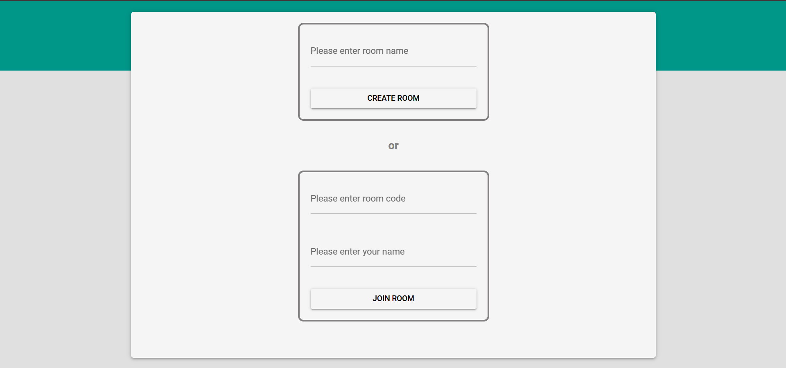

# Chit Chat

Chit Chat is a Chat Web Application, created using Typescript, NodeJS, ExpressJS, WebSockets, VueJS, Quasar.

## Usage

- User can create a chat room providing a name and it will generate a unique code for the room to share with others
- Others can join the room providing the room code and their name
- In the room, user's name and a auto-generated avatar will be shown beside their text and also the timestamp of each message

## Bootstrapping

- Clone the repo and open the folder in your code editor
- Change the '.env.example' files in both backend and frontend folders to '.env' files and update the properties properly
- Create an instance of the terminal and copy-paste the following:

```sh
cd backend
npm i
npm start
```

- Create another instance of the terminal and copy-paste the following:

```sh
cd frontend
npm i
npm i -g @quasar/cli
quasar dev
```

## Views




## License

[MIT](LICENSE)
